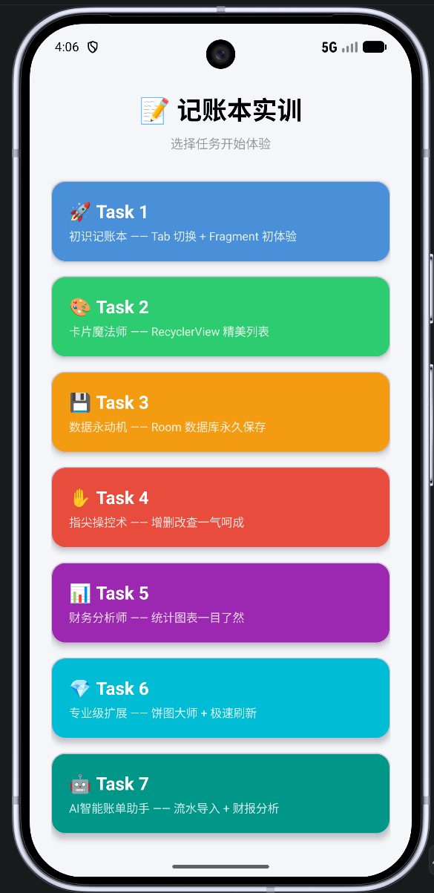
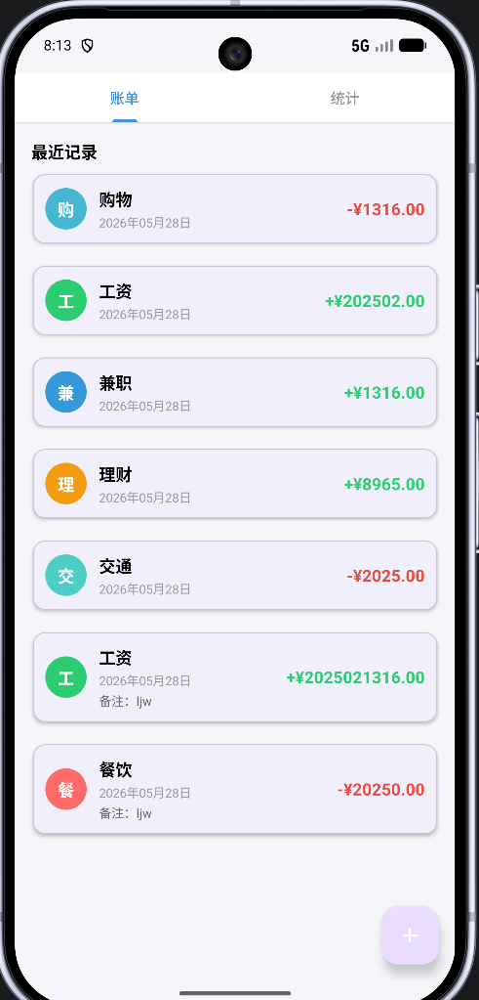
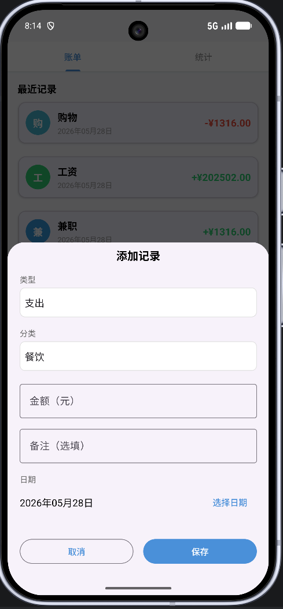
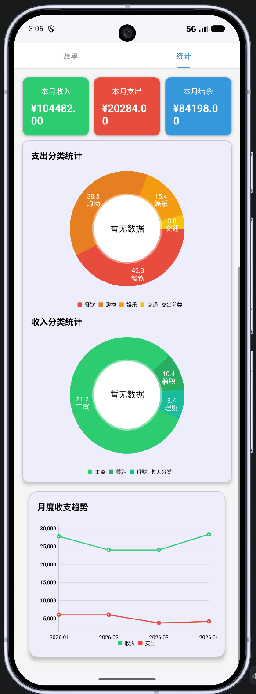
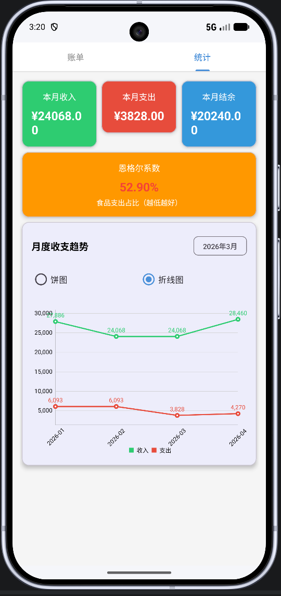
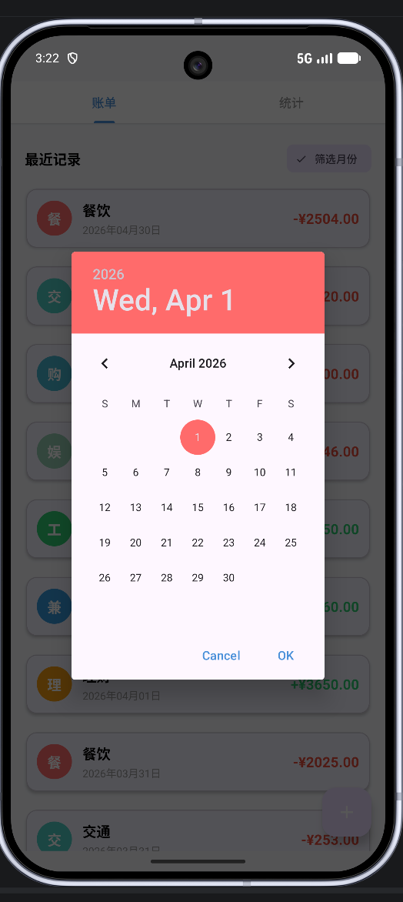
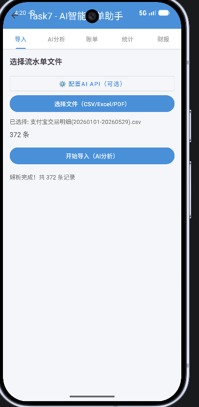
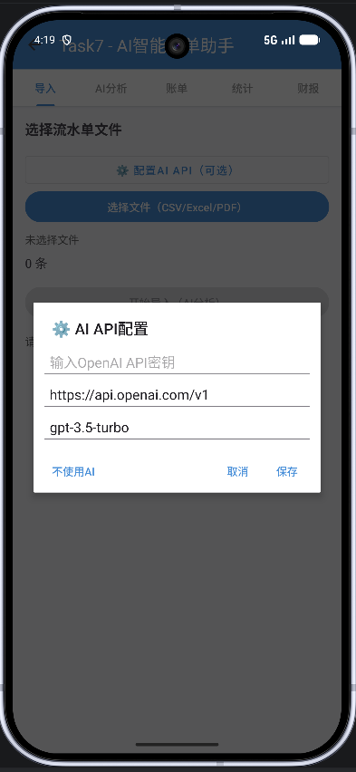
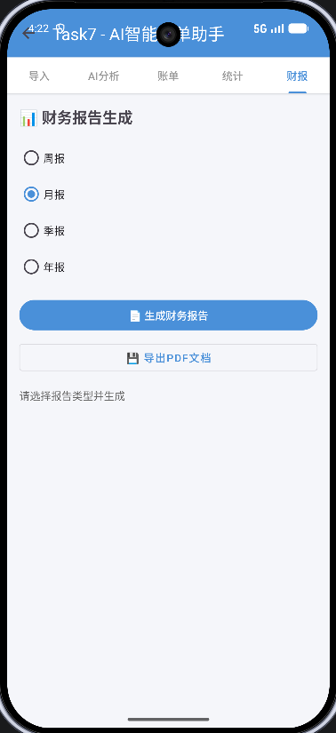
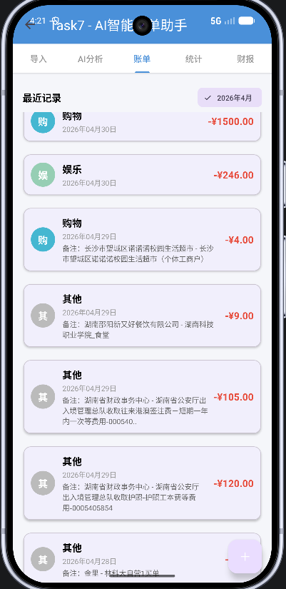

# 📱 个人记账本 (AccountBook) - 从零到AI智能助手

> **林涉外 27 届计科实习 - 移动应用开发完整项目**  
> 作者学号：2025021316 | GitHub: [ljwei-stak](https://github.com/ljwei-stak)

一个**渐进式学习**的 Android 记账本应用，通过 **7 个逐步进阶的任务模块**，从最简单的 Hello World 发展到功能完整的 AI 智能账单助手。

## 🌟 项目亮点

✨ **完整的学习路径**: 从零基础到成品应用的完整演进过程  
🏗️ **现代架构实践**: MVVM + Room + LiveData + ViewBinding + Coroutines  
🤖 **AI 集成**: OpenAI API 智能分类 + 财务报告生成  
📊 **数据可视化**: MPAndroidChart 饼图/折线图实时统计  
💾 **本地持久化**: Room 数据库 + SQLite 查询优化  
🎨 **Material Design**: 精美 UI + 流畅动画 + DiffUtil 性能优化  
📈 **专业报表**: iText7 生成 PDF 财务报告  
🔄 **文件解析**: 支持支付宝 CSV / 微信 Excel / 银行 PDF 流水导入

## 🎯 项目简介

本项目是一个**从入门到精通**的完整 Android 学习项目，通过 Task1-Task7 七个阶段逐步展示现代 Android 开发的核心技术栈和最佳实践。

### 📚 学习路径概览

| 阶段 | 任务名称 | 核心技术 | 完成状态 |
|------|---------|---------|----------|
| **Task 1** | 🚀 初识记账本 | TabLayout + ViewPager2 + Fragment | ✅ 完成 |
| **Task 2** | 🎨 卡片魔法师 | RecyclerView + MaterialCardView + Adapter | ✅ 完成 |
| **Task 3** | 💾 数据永动机 | Room Database + MVVM + LiveData | ✅ 完成 |
| **Task 4** | ✋ 指尖操控术 | BottomSheetDialog + CRUD + DatePicker | ✅ 完成 |
| **Task 5** | 📊 财务分析师 | 实时统计 + LiveData 跨Fragment共享 | ✅ 完成 |
| **Task 6** | 💎 专业级扩展 | MPAndroidChart + DiffUtil + SearchView | ✅ 完成 |
| **Task 7** | 🤖 AI智能助手 | OpenAI API + CSV解析 + PDF生成 | ✅ 完成 |

### 🎓 适合人群

- 📱 **Android 初学者**: 从零开始，循序渐进学习 Android 开发
- 🎒 **计算机专业学生**: 完整的课程设计和毕业设计参考
- 💼 **求职者**: 展示完整的 Android 项目经验和技术栈
- 🔧 **开发者**: 学习现代 Android 架构和最佳实践

## ✨ 功能特性

### Task 1 - 🚀 初识记账本（第一个可交互的 App）

**学习目标**: 项目创建、Tab 切换、Fragment 初体验

- ✅ **TabLayout + ViewPager2** 实现左右滑动切换页面
- ✅ **Fragment 基础架构**搭建，账单页和统计页分离
- ✅ **ViewBinding** 启用，类型安全的视图访问
- ✅ **Edge-to-Edge** 沉浸式布局支持
- ✅ 今天结束时你能看到：手机上跑着一个能左右滑切换“账单”和“统计”的 App

**技术要点**:
```kotlin
// ActivityTaskBinding 自动生成的绑定类
binding = ActivityTaskBinding.inflate(layoutInflater)
setContentView(binding.root)

// TabLayoutMediator 关联 Tab 和 ViewPager2
TabLayoutMediator(binding.tabLayout, binding.viewPager) { tab, position ->
    tab.text = when (position) {
        0 -> getString(R.string.tab_bills)      // “账单”
        1 -> getString(R.string.tab_statistics)  // “统计”
    }
}.attach()
```

---

### Task 2 - 🎨 卡片魔法师（精美列表展示）

**学习目标**: RecyclerView、Material Design、Adapter 模式

- ✅ **MaterialCardView** 精美卡片设计，圆角阴影效果
- ✅ **RecyclerView** 列表展示，支持滚动和复用
- ✅ **5 条假数据**演示（收入/支出），颜色区分
- ✅ **悬浮按钮 (FAB)** 交互，点击弹出 Toast
- ✅ **金额颜色区分**: 绿色收入 (+¥)、红色支出 (-¥)
- ✅ **备注显隐逻辑**: 有备注时显示，无备注时隐藏

**技术要点**:
```kotlin
// RecyclerView Adapter 基础结构
class RecordAdapter(
    private val onItemClick: (Record) -> Unit,
    private val onItemLongClick: (Record) -> Unit
) : RecyclerView.Adapter<RecordAdapter.RecordViewHolder>() {
    
    override fun onCreateViewHolder(...) = ...
    override fun onBindViewHolder(...) = ...
    override fun getItemCount() = records.size
}
```

---

### Task 3 - 💾 数据永动机（Room 数据库持久化）

**学习目标**: Room Database、MVVM 架构、LiveData 响应式编程

- ✅ **Room 数据库**集成，SQLite 抽象层
- ✅ **MVVM 架构模式**: Model-View-ViewModel 分层
- ✅ **LiveData 数据观察**: 数据变化自动通知 UI
- ✅ **ViewModel 状态管理**: 生命周期感知，配置变更不丢失
- ✅ **KSP (Kotlin Symbol Processing)**: 编译时代码生成
- ✅ **数据永久保存**: 卸载前数据不会丢失

**技术要点**:
```kotlin
// @Entity 定义数据库表
@Entity(tableName = "records")
data class Record(
    @PrimaryKey(autoGenerate = true) val id: Long = 0,
    @ColumnInfo(name = "type") val type: Int,        // 0=支出, 1=收入
    @ColumnInfo(name = "category") val category: String,
    @ColumnInfo(name = "amount") val amount: Double,
    @ColumnInfo(name = "note") val note: String? = null,
    @ColumnInfo(name = "date") val date: Long
)

// @Dao 定义数据访问接口
@Dao
interface RecordDao {
    @Query("SELECT * FROM records ORDER BY date DESC")
    suspend fun getAllRecords(): List<Record>
    
    @Insert(onConflict = OnConflictStrategy.REPLACE)
    suspend fun insert(record: Record): Long
}

// ViewModel 管理数据
val allRecords: LiveData<List<Record>> get() = _allRecords
```

---

### Task 4 - ✋ 指尖操控术（完整的增删改查）

**学习目标**: Dialog、表单验证、日期选择器、用户交互

- ✅ **BottomSheetDialog** 添加/编辑弹窗，底部滑出动画
- ✅ **DatePicker** 日期选择器，日历界面选择日期
- ✅ **Spinner** 分类联动，根据收入/支出动态切换分类
- ✅ **长按删除** + AlertDialog 确认对话框
- ✅ **输入校验**: 金额必须为正数、分类不能为空
- ✅ **Snackbar** 提示操作结果
- ✅ **实时刷新**: 添加/删除后列表自动更新

**技术要点**:
```kotlin
// BottomSheetDialog 自定义布局
val dialog = AddEditRecordDialog(
    editRecord = null,  // null 表示新增，非 null 表示编辑
    onSave = { record ->
        viewModel.insert(record)
        Toast.makeText(context, "添加成功", Toast.LENGTH_SHORT).show()
    }
)
dialog.show(childFragmentManager, "AddDialog")

// DatePickerDialog 选择日期
DatePickerDialog(requireContext(), { _, year, month, day ->
    val calendar = Calendar.getInstance()
    calendar.set(year, month, day)
    selectedDate = calendar.timeInMillis
}, year, month, day).show()
```

---

### Task 5 - 📊 财务分析师（实时统计图表）

**学习目标**: LiveData 跨 Fragment 共享、数据统计、响应式更新

- ✅ **实时统计**总收入、总支出、结余
- ✅ **LiveData 跨 Fragment 数据共享**: 账单页改动 → 统计页自动刷新
- ✅ **三列汇总卡片**: 绿色收入、红色支出、蓝色结余
- ✅ **自动计算与更新**: 无需手动刷新，数据变化即时反映
- ✅ **饼图占位区**: 为进阶篇预留（Task 6 实现）
- ✅ **格式化显示**: 金额千分位分隔符，小数点两位

**技术要点**:
```kotlin
// ViewModel 中共享数据
private val _totalIncome = MutableLiveData(0.0)
val totalIncome: LiveData<Double> get() = _totalIncome

private val _totalExpense = MutableLiveData(0.0)
val totalExpense: LiveData<Double> get() = _totalExpense

// Fragment 中观察数据变化
viewModel.totalIncome.observe(viewLifecycleOwner) { income ->
    binding.tvIncome.text = "¥${String.format("%.2f", income)}"
}

// SQL 聚合查询
@Query("SELECT SUM(amount) FROM records WHERE type = ${Record.TYPE_INCOME}")
suspend fun getTotalIncome(): Double?
```

---

### Task 6 - 让记账本更专业 💎
- ✅ **X1 饼图大师**: 支出/收入分类占比可视化（环形饼图）
- ✅ **X2 趋势分析师**: 月度收支趋势折线图（绿色收入线 vs 红色支出线）
- ✅ **X3 月度筛选器**: 只看某个月的记录（Chip按钮 + DatePickerDialog）
- ✅ **X4 智能搜索**: 按关键词搜索记录（SearchView实时搜索）
- ✅ **X5 极速刷新**: DiffUtil精准更新列表（自动动画 + 性能优化）

### Task 7 - AI智能账单助手 🤖（成品级应用）
- ✅ **流水单导入**: 支持支付宝CSV、微信Excel、银行PDF格式
- ✅ **AI API配置**: 用户友好的API密钥配置对话框
- ✅ **智能分类录入**: AI自动解析流水单并智能分类
- ✅ **账单管理**: 完整的增删改查功能（从Task6迁移）
- ✅ **统计分析**: 收支汇总 + 饼图可视化（从Task6迁移）
- ✅ **财报生成**: 周/月/季/年财务报告生成
- ✅ **PDF导出**: 专业财务报告文档导出

## 🛠️ 技术栈

| 技术 | 版本 | 说明 |
|------|------|------|
| **Kotlin** | 2.2.10 | 主要编程语言 |
| **AGP** | 9.2.1 | Android Gradle Plugin |
| **Room** | 2.7.2 | 本地数据库 |
| **Lifecycle** | 2.9.0 | ViewModel + LiveData |
| **Material Design** | 1.14.0 | UI 组件库 |
| **ViewPager2** | 1.1.0 | 页面滑动 |
| **KSP** | 2.2.10-2.0.2 | Kotlin Symbol Processing |

##  界面预览

### 主界面

*任务选择菜单，包含 Task 1-7 七个渐进式学习模块，点击任意卡片进入对应功能*

### Task 1-3 - 基础功能
> Task 1-3 主要是基础架构搭建，界面与 Task 4 类似

### Task 4 - 增删改查

#### 账单列表

*精美的卡片式列表，清晰展示收支记录，绿色表示收入，红色表示支出*

#### 添加记录

*底部弹窗 (BottomSheetDialog)，支持选择类型、分类、金额、备注和日期*

### Task 5 - 实时统计与饼图

#### 优化后的统计展示（当前版本）

*环形饼图直观展示收支分类占比，包含图例和百分比，数据实时更新*

#### 优化前的统计展示（旧版本）

*早期版本使用文本列表展示分类统计，后升级为饼图可视化*

### Task 6 - 专业级扩展功能

#### 饼图和折线图切换（X1/X2）

*支持饼图和折线图切换显示，环形饼图展示分类占比，折线图展示月度趋势*

#### 优化后的展示包含恩格尔系数

*新增恩格尔系数计算，颜色提示生活水平（富裕/小康/温饱/贫困）*

#### 月度筛选器（X3）

*点击“筛选月份”Chip按钮，选择年月后只显示该月记录*

---

### Task 7 - AI智能账单助手 🤖

#### 流水单导入功能

*支持三种格式的金融流水单导入：支付宝CSV、微信Excel、银行PDF*

#### API配置界面

*用户友好的AI API配置对话框，支持OpenAI及兼容API，可设置密钥、URL和模型*

#### AI产生财报

*AI智能分析交易数据，自动生成周/月/季/年财务报告，支持PDF导出*

#### 导入流水后的没有使用AI分析的账单

*即使不使用AI API，系统也会通过关键词匹配进行智能分类，保证基本准确率*

## 🚀 快速开始

### 环境要求
- Android Studio Hedgehog 或更高版本
- JDK 11+
- Android SDK API 28+ (Android 9.0)
- Gradle 9.4.1+

### 安装步骤

1. **克隆仓库**
```bash
git clone https://github.com/ljwei-stak/getjobwork.git
cd getjobwork
```

2. **打开项目**
   - 使用 Android Studio 打开项目根目录
   - 等待 Gradle 同步完成

3. **运行应用**
   - 连接真机或启动模拟器
   - 点击 Run 按钮 (▶) 或按 `Shift + F10`

## 📂 项目结构

```
getjobwork/
├── app/
│   ├── src/main/
│   │   ├── java/edu/guigu/accountbook/
│   │   │   ├── data/                  # 数据层
│   │   │   │   ├── dao/              # 数据访问对象
│   │   │   │   │   └── RecordDao.kt
│   │   │   │   ├── database/         # 数据库
│   │   │   │   │   └── AppDatabase.kt
│   │   │   │   ├── model/            # 数据模型
│   │   │   │   │   └── Record.kt
│   │   │   │   └── repository/       # 数据仓库
│   │   │   │       └── RecordRepository.kt
│   │   │   ├── ui/                    # 界面层
│   │   │   │   ├── adapter/          # 适配器
│   │   │   │   │   ├── RecordAdapter.kt      # ✅ X5: 支持DiffUtil
│   │   │   │   │   └── Task2FakeAdapter.kt
│   │   │   │   ├── dialog/           # 对话框
│   │   │   │   │   └── AddEditRecordDialog.kt
│   │   │   │   ├── fragment/         # 碎片
│   │   │   │   │   ├── BillsFragment.kt
│   │   │   │   │   └── StatisticsFragment.kt
│   │   │   │   ├── task/             # 任务 Activity
│   │   │   │   │   ├── Task1Activity.kt
│   │   │   │   │   ├── Task2Activity.kt
│   │   │   │   │   ├── Task3Activity.kt
│   │   │   │   │   ├── Task4Activity.kt
│   │   │   │   │   ├── Task5Activity.kt
│   │   │   │   │   └── Task6Activity.kt      # ✅ Task6主入口
│   │   │   │   │   ├── Task6BillsFragment.kt    # ✅ X3/X4/X5
│   │   │   │   │   └── Task6StatisticsFragment.kt # ✅ X1/X2
│   │   │   │   └── viewmodel/        # 视图模型
│   │   │   │       └── RecordViewModel.kt
│   │   │   ├── util/                  # 工具类
│   │   │   │   └── DateUtils.kt
│   │   │   └── MainActivity.kt       # 主活动
│   │   ├── res/                       # 资源文件
│   │   │   ├── layout/               # 布局文件
│   │   │   ├── values/               # 颜色、字符串等
│   │   │   └── drawable/             # 图形资源
│   │   └── AndroidManifest.xml
│   └── build.gradle.kts
├── gradle/
├── build.gradle.kts
└── settings.gradle.kts
```

## 🏗️ 架构设计

本项目采用 **MVVM (Model-View-ViewModel)** 架构模式：

```
┌─────────────┐
│   View      │  ← Activity / Fragment (UI)
└──────┬──────┘
       │ observes
┌──────▼──────┐
│ ViewModel   │  ← LiveData + Coroutine
└──────┬──────┘
       │ calls
┌──────▼──────┐
│ Repository  │  ← 数据仓库
└──────┬──────┘
       │ uses
┌──────▼──────┐
│    DAO      │  ← Room Database
└─────────────┘
```

### 数据流
1. **用户操作** → View (Activity/Fragment)
2. **View** → 调用 ViewModel 方法
3. **ViewModel** → 通过 Repository 访问数据
4. **Repository** → 使用 DAO 操作数据库
5. **数据库变化** → LiveData 自动通知 View 更新

## 📊 数据库设计

### Record 表结构

| 字段 | 类型 | 说明 |
|------|------|------|
| id | Long | 主键，自增 |
| type | Int | 类型：0=支出, 1=收入 |
| category | String | 分类名称 |
| amount | Double | 金额 |
| note | String? | 备注（可选） |
| date | Long | 时间戳（毫秒） |

### 分类列表

**支出分类** (8个):
餐饮 🍜、交通 🚌、购物 🛒、娱乐 🎮、住房 🏠、医疗 🏥、教育 📚、其他 📌

**收入分类** (5个):
工资 💰、兼职 💼、理财 📈、红包 🧧、其他 📌

## 🔧 配置说明

### 依赖配置

项目使用 **Version Catalog** (`gradle/libs.versions.toml`) 管理依赖：

```toml
[versions]
agp = "9.2.1"
kotlin = "2.2.10"
room = "2.7.2"
lifecycle = "2.9.0"
```

### 构建配置

```kotlin
android {
    namespace = "edu.guigu.accountbook"
    compileSdk = 36
    minSdk = 28
    targetSdk = 36
    
    buildFeatures {
        viewBinding = true  // 启用 ViewBinding
    }
}
```

## 🧪 测试

### 运行测试
```bash
# 单元测试
./gradlew test

# 仪器化测试
./gradlew connectedAndroidTest
```

### 测试用例
- ✅ Task 1: Tab 切换流畅性测试
- ✅ Task 2: 列表显示、金额颜色、备注显隐
- ✅ Task 3: 空列表、数据库文件存在性
- ✅ Task 4: 增删改查、输入校验、持久化
- ✅ Task 5: 统计数据实时更新、跨Fragment同步
- ✅ Task 6: 
  - X1: 饼图显示正确、分类颜色区分、百分比准确
  - X5: 列表动画流畅、无闪烁、局部刷新生效

## 📖 Task6 详细说明

### 🎯 任务概述

Task6 是一个**可选的进阶挑战集合**，包含5个独立的小任务。每个任务都是独立的，您可以挑感兴趣的做，不需要按顺序完成。

### ✨ 已完成功能

#### ✅ X1: 饼图大师 - 支出分类占比可视化
- **位置**: `Task6StatisticsFragment`
- **功能**: 
  - 支出分类饼图（空心圆环）
  - 收入分类饼图（空心圆环）
  - 自动显示百分比和金额
  - 支持旋转交互
  - 数据实时更新

#### ✅ X2: 趋势分析师 - 月度收支趋势折线图
- **位置**: `Task6StatisticsFragment`
- **功能**:
  - 绿色折线表示收入趋势
  - 红色折线表示支出趋势
  - X轴显示月份（如 2025-05）
  - **数据点下方显示金额数字**（优化后）
  - 支持拖拽、缩放、捏合缩放
  - 底部图例说明
  - 数据实时更新

#### ✅ X3: 月度筛选器 - 只看某个月的记录
- **位置**: `Task6BillsFragment`
- **功能**:
  - 点击“筛选月份”Chip按钮
  - DatePickerDialog只显示年月选择
  - 自动计算该月第一天和最后一天
  - Chip显示选中月份（如 “2025年5月”）
  - 点击X按钮清除筛选，恢复全部记录

#### ✅ X4: 智能搜索 - 按关键词搜索记录
- **位置**: `Task6BillsFragment`
- **功能**:
  - 长按“筛选月份”按钮显示/隐藏搜索框
  - SearchView实时搜索（输入即搜索）
  - 搜索范围：分类名 + 备注
  - 支持SQL LIKE模糊查询
  - 空搜索时恢复全部记录

#### ✅ X5: 极速刷新 - DiffUtil精准更新列表
- **位置**: `RecordAdapter.kt`
- **功能**:
  - 使用DiffUtil替代notifyDataSetChanged()
  - 只刷新变化的部分，提升性能
  - 自动播放插入/删除动画
  - 支持Payload局部刷新优化
  - 列表不再闪烁

### 🔧 功能已全部完成

> **恭喜！Task6的所有功能（X1-X5）已全部实现！**

### 🔧 新增优化功能（2026年5月）

#### ✨ 图表切换功能
- **位置**: `Task6StatisticsFragment`
- **功能**:
  - RadioGroup切换饼图和折线图
  - 默认显示饼图（支出+收入分类占比）
  - 切换到折线图时隐藏饼图，显示月度趋势
  - 动态更新标题（“支出分类统计” ↔ “月度收支趋势”）

#### ✨ 月份选择器
- **位置**: `Task6StatisticsFragment`
- **功能**:
  - 点击“选择月份”Chip按钮
  - DatePickerDialog只显示年月选择
  - 自动加载选中月份的收支结余
  - 顶部卡片实时显示该月收入、支出、结余
  - 默认显示当前月份

#### ✨ 恩格尔系数计算
- **位置**: `Task6StatisticsFragment`
- **功能**:
  - 计算公式：食品支出 / 总支出
  - 颜色提示：
    - <30%: 绿色（富裕）
    - 30%-40%: 黄色（小康）
    - 40%-50%: 橙色（温饱）
    - >50%: 红色（贫困）
  - 百分比精确到小数点后两位
  - 无数据时显示“--”

### 🚀 如何运行Task6

1. 在Android Studio中打开项目
2. 找到`Task6Activity.kt`
3. 点击运行按钮 ▶️
4. 或者在MainActivity中添加跳转按钮

### 🎯 Task6 测试要点

#### X2 折线图测试
- [ ] 添加多个月份的收支记录
- [ ] 切换到统计页，查看折线图是否正常显示
- [ ] 验证绿色线=收入，红色线=支出
- [ ] 验证X轴显示月份标签
- [ ] 测试拖拽、缩放功能
- [ ] 添加新记录后，折线图自动刷新

#### X3 月度筛选测试
- [ ] 点击“筛选月份”按钮，弹出日期选择器
- [ ] 验证日期选择器只显示年月（日已隐藏）
- [ ] 选择月份后，Chip显示“2025年5月”格式
- [ ] 验证列表只显示该月记录
- [ ] 点击Chip的X按钮，清除筛选，恢复全部记录

#### X4 智能搜索测试
- [ ] 长按“筛选月份”按钮，搜索框出现
- [ ] 输入关键词（如“餐饮”），列表实时过滤
- [ ] 验证搜索匹配分类名和备注
- [ ] 清空搜索框，恢复全部记录
- [ ] 再次长按按钮，搜索框隐藏

#### X5 DiffUtil测试
- [ ] 添加一条记录 → 新卡片从底部滑入（有动画）
- [ ] 编辑一条记录的金额 → 该行金额平滑更新，其他行不动
- [ ] 删除一条记录 → 该卡片淡出消失（有动画）
- [ ] 快速添加/删除多条记录，列表不闪烁
- [ ] 大量数据时（几十条）滑动依然丝滑

### 💡 DiffUtil工作原理

```
旧列表：   [A,   B,   C,   D]
新列表：   [A,   C,   E,   D]
           ↑   ↑     ↑   ↑
DiffUtil: 不变  删B  加E  不变  →  只刷新这 3 条！
```

**关键代码**:
```kotlin
// 使用DiffUtil计算差异
val diffResult = DiffUtil.calculateDiff(
    RecordDiffCallback(records, newRecords)
)
records.clear()
records.addAll(newRecords)
diffResult.dispatchUpdatesTo(this)  // 精准更新
```

---

## 🤖 Task7 - AI智能账单助手 完整指南

### 📱 应用架构

Task7是一个**功能完整的独立记账应用**，包含5个核心Tab：

```
Task7Activity (5个Tab)
├── Tab 1: 导入 💾
├── Tab 2: AI分析 🤖
├── Tab 3: 账单 📝
├── Tab 4: 统计 📊
└── Tab 5: 财报 📈
```

### ✨ Task7 核心功能

#### Tab 1: 导入 💾

**文件**: `Task7ImportFragment.kt`

##### 核心功能
- ✅ **文件选择器** - 支持CSV/Excel/PDF格式
- ✅ **支付宝CSV解析** - 完整实现，支持GBK编码
- ✅ **AI API配置** - 用户友好的对话框
- ✅ **智能分类录入** - 自动解析并写入数据库
- ✅ **进度显示** - 实时显示导入状态

##### 使用流程
1. 点击“⚙️ 配置AI API”（可选）
   - 输入OpenAI API密钥
   - 设置API基础URL和模型
   - 或选择“不使用AI”（使用本地关键词分类）

2. 点击“选择文件（CSV/Excel/PDF）”
   - 选择支付宝流水单CSV文件
   - 系统自动解析并显示记录数量

3. 点击“开始导入（AI分析）”
   - AI分析每笔交易的分类
   - 自动录入到数据库
   - 显示成功/失败统计

##### 技术细节
- 使用OpenCSV库解析CSV
- 支持支付宝GBK编码
- 自动跳过24行表头
- 分类映射规则（餐饮、交通、购物等8类）
- AI降级方案（无API时使用关键词匹配）

---

#### Tab 2: AI分析 🤖

**文件**: `Task7AnalysisFragment.kt`

##### 当前状态
- ⏳ 占位符页面
- 📝 待实现完整UI

##### 计划功能
- 展示AI分析结果
- 显示置信度评分
- 交易标签云
- 分析历史记录

---

#### Tab 3: 账单 📝

**文件**: `Task7BillsFragment.kt`

##### 核心功能（从Task6迁移）
- ✅ **增删改查** - 完整的CRUD操作
- ✅ **月度筛选器** - Chip按钮选择月份
- ✅ **智能搜索** - 长按Chip显示SearchView
- ✅ **DiffUtil刷新** - 精准列表更新，带动画
- ✅ **FAB添加** - 快速添加新记录

##### 交互细节
- **点击记录** → 编辑对话框
- **长按记录** → 删除确认
- **点击Chip** → 月份选择器（只显示年月）
- **长按Chip** → 显示/隐藏搜索框
- **搜索** → 实时过滤（分类+备注）

##### 技术亮点
- 使用ViewModel共享数据
- LiveData响应式更新
- DiffUtil性能优化
- DatePickerDialog自定义（隐藏日期）

---

#### Tab 4: 统计 📊

**文件**: `Task7StatisticsFragment.kt`

##### 核心功能（从Task6迁移）
- ✅ **收支汇总** - 本月收入/支出/结余卡片
- ✅ **支出饼图** - 空心圆环，显示百分比
- ✅ **收入饼图** - 空心圆环，显示百分比
- ✅ **实时更新** - 数据变化自动刷新

##### 图表特性
- MPAndroidChart库
- 可旋转交互
- 底部图例
- 动画效果
- 不同分类颜色区分

##### 数据来源
- 共享RecordViewModel
- LiveData观察数据变化
- 自动计算分类占比

---

#### Tab 5: 财报 📈

**文件**: `Task7ReportFragment.kt`

##### 核心功能
- ✅ **报告类型选择** - 周/月/季/年RadioGroup
- ✅ **生成报告按钮** - 触发统计逻辑
- ✅ **导出PDF按钮** - 调用iText7生成
- ✅ **状态显示** - 清晰的TODO提示

##### PDF生成器（已完成）
**文件**: `PDFReportGenerator.kt`

- ✅ iText7完整集成
- ✅ 专业报表布局
- ✅ 包含内容：
  - 标题和日期范围
  - 财务汇总表格
  - 分类统计
  - TOP 10支出
  - AI智能建议
- ✅ 保存到Downloads目录

##### 待实现
- ⏳ 数据聚合查询（周/月/季/年）
- ⏳ FinancialReport对象构建
- ⏳ AI洞察生成调用

---

### 🔧 Task7 技术栈

#### 核心依赖
```kotlin
// UI
implementation(libs.material)              // Material Design
implementation(libs.fragment.ktx)          // Fragment KTX
implementation(libs.viewpager2)            // ViewPager2

// 数据
implementation(libs.room.runtime)          // Room数据库
implementation(libs.room.ktx)              // Room KTX
ksp(libs.room.compiler)                    // KSP编译
implementation(libs.lifecycle.viewmodel.ktx)    // ViewModel
implementation(libs.lifecycle.livedata.ktx)     // LiveData

// 图表
implementation(libs.mpandroidchart)        // MPAndroidChart

// 文件处理
implementation("com.opencsv:opencsv:5.7.1")           // CSV解析
implementation("org.apache.poi:poi:5.2.5")            // Excel解析
implementation("com.itextpdf:itext7-core:7.2.5")      // PDF生成

// 网络
implementation("com.squareup.retrofit2:retrofit:2.9.0")              // Retrofit
implementation("com.squareup.retrofit2:converter-gson:2.9.0")        // Gson
implementation("com.squareup.okhttp3:logging-interceptor:4.12.0")    // 日志
```

#### 架构模式
- **MVVM** - Model-View-ViewModel
- **Repository** - 数据仓库模式
- **LiveData** - 响应式数据流
- **Coroutine** - 协程异步处理

---

### 🚀 Task7 使用指南

#### 首次使用

1. **同步Gradle**
   ```
   Android Studio → File → Sync Project with Gradle Files
   ```

2. **运行应用**
   ```
   找到Task7Activity → Run 'Task7Activity'
   ```

3. **测试导入功能**
   - 切换到Tab 1 “导入”
   - 点击“选择文件”
   - 选择`file/支付宝交易明细.csv`
   - 等待解析完成
   - 点击“开始导入”

4. **查看账单**
   - 切换到Tab 3 “账单”
   - 查看导入的记录
   - 测试筛选和搜索

5. **查看统计**
   - 切换到Tab 4 “统计”
   - 查看饼图和汇总

---

### 📊 Task7 数据流

```
用户导入CSV
    ↓
TransactionParser解析
    ↓
List<TransactionRecord>
    ↓
AIService分析分类（可选）
    ↓
转换为Record对象
    ↓
Room数据库插入
    ↓
ViewModel LiveData更新
    ↓
UI自动刷新（账单/统计）
```

---

### 🎯 Task7 与 Task6 的关系

| 特性 | Task6 | Task7 |
|------|-------|-------|
| 定位 | 学习项目 | 成品应用 |
| Tab数量 | 2个 | 5个 |
| 流水导入 | ❌ | ✅ |
| AI分析 | ❌ | ✅ |
| 账单管理 | ✅ | ✅ (迁移) |
| 统计分析 | ✅ | ✅ (迁移) |
| 财报生成 | ❌ | ⏳ |
| PDF导出 | ❌ | ✅ (模板) |
| 数据共享 | - | ✅ 同一数据库 |

**重要**: Task6和Task7共享同一个Room数据库，数据完全互通！

---

### 🐛 Task7 已知问题

#### 高优先级
1. ⏳ AI分析页面未完善
2. ⏳ 财报统计逻辑未实现
3. ⏳ Excel/PDF解析未完成

#### 中优先级
4. 💡 导入大量数据时可能较慢
5. 💡 缺少导入历史记录
6. 💡 无数据备份功能

#### 低优先级
7. 📝 UI可以进一步优化
8. 📝 缺少引导教程
9. 📝 无夜间模式

---

### 📝 Task7 开发路线图

#### Phase 1: 核心功能（已完成✅）
- [x] 文件导入框架
- [x] CSV解析
- [x] 账单管理迁移
- [x] 统计页面迁移
- [x] PDF生成器

#### Phase 2: 完善功能（进行中⏳）
- [ ] AI分析页面UI
- [ ] 财报统计逻辑
- [ ] 导入进度优化
- [ ] 错误处理增强

#### Phase 3: 扩展功能（计划📅）
- [ ] Excel解析（Apache POI）
- [ ] PDF解析（PDFBox）
- [ ] 数据备份/恢复
- [ ] 云端同步
- [ ] 定时报告

#### Phase 4: 优化体验（未来🔮）
- [ ] 动画优化
- [ ] 夜间模式
- [ ] 多语言支持
- [ ] 无障碍适配

---

### 💡 Task7 使用技巧

#### 提高导入准确率
1. **配置AI API** - 使用GPT-3.5或更高版本
2. **检查CSV格式** - 确保是标准支付宝格式
3. **小批量测试** - 先导入少量数据验证

#### 高效管理账单
1. **月度筛选** - 快速定位某月记录
2. **智能搜索** - 长按Chip输入关键词
3. **批量删除** - 长按记录逐个删除

#### 生成专业报告
1. **选择合适周期** - 月报最常用
2. **检查数据完整性** - 确保所有记录已导入
3. **导出PDF备份** - 定期保存到云端

---

### 📞 Task7 常见问题

**Q: 为什么无法选择CSV文件？**
A: 确保文件选择器权限已授予，文件必须在设备存储中。

**Q: 导入后分类不准确？**
A: 配置OpenAI API可提高准确率，或手动编辑分类。

**Q: PDF在哪里？**
A: 保存在`Downloads/AccountBookReports/`目录。

**Q: 数据会丢失吗？**
A: 数据存储在Room数据库，卸载应用会清除。建议定期导出PDF备份。

---

## 📝 开发笔记

### AGP 9.x 注意事项

1. **不需要单独声明 kotlin-android 插件**
   ```kotlin
   plugins {
       alias(libs.plugins.android.application)
       // ❌ 不需要: alias(libs.plugins.kotlin.android)
       alias(libs.plugins.ksp)
   }
   ```

2. **不支持 kotlinOptions DSL**
   ```kotlin
   // ❌ 错误写法
   kotlinOptions {
       jvmTarget = "11"
   }
   
   // ✅ 只需保留 compileOptions
   compileOptions {
       sourceCompatibility = JavaVersion.VERSION_11
       targetCompatibility = JavaVersion.VERSION_11
   }
   ```

### ViewBinding 最佳实践

```kotlin
// Fragment 中防止内存泄漏
private var _binding: FragmentBillsBinding? = null
private val binding get() = _binding!!

override fun onDestroyView() {
    super.onDestroyView()
    _binding = null  // ⭐ 重要！
}
```

## 🏗️ 技术架构详解

### 整体架构图

```
┌─────────────────────────────────────────────────────┐
│                    Presentation Layer                │
│  ┌──────────┐ ┌──────────┐ ┌──────────┐            │
│  │ Activity │ │Fragment  │ │  Dialog  │            │
│  └────┬─────┘ └────┬─────┘ └────┬─────┘            │
│       │             │             │                  │
│  ┌────▼─────────────▼─────────────▼─────┐           │
│  │         ViewBinding (UI)             │           │
│  └────────────────┬────────────────────┘           │
└───────────────────┼────────────────────────────────┘
                    │ observes / calls
┌───────────────────▼────────────────────────────────┐
│                     ViewModel Layer                 │
│  ┌──────────────────────────────────────────┐      │
│  │     RecordViewModel (LiveData)           │      │
│  │  - allRecords: LiveData<List<Record>>    │      │
│  │  - totalIncome: LiveData<Double>         │      │
│  │  - totalExpense: LiveData<Double>        │      │
│  └────────────────┬─────────────────────────┘      │
└───────────────────┼────────────────────────────────┘
                    │ calls
┌───────────────────▼────────────────────────────────┐
│                   Repository Layer                  │
│  ┌──────────────────────────────────────────┐      │
│  │       RecordRepository                   │      │
│  │  - suspend fun getAllRecords()           │      │
│  │  - suspend fun insert(record: Record)    │      │
│  └────────────────┬─────────────────────────┘      │
└───────────────────┼────────────────────────────────┘
                    │ uses
┌───────────────────▼────────────────────────────────┐
│                      Data Layer                     │
│  ┌──────────┐ ┌──────────┐ ┌──────────┐          │
│  │   DAO    │ │ Database │ │  Model   │          │
│  │RecordDao │ │AppDatabase│ │ Record   │          │
│  └──────────┘ └──────────┘ └──────────┘          │
└────────────────────────────────────────────────────┘
```

### MVVM 架构模式

本项目严格遵循 **MVVM (Model-View-ViewModel)** 架构模式，实现关注点分离：

#### 1. Model (数据层)
- **Entity**: `Record.kt` - 数据库表结构定义
- **DAO**: `RecordDao.kt` - 数据访问对象，SQL 查询
- **Database**: `AppDatabase.kt` - Room 数据库实例
- **Repository**: `RecordRepository.kt` - 数据仓库，抽象数据源

#### 2. ViewModel (视图模型层)
- **RecordViewModel.kt** - 管理 UI 相关数据，处理业务逻辑
- 使用 `LiveData` 实现响应式数据流
- 生命周期感知，配置变更不丢失数据

#### 3. View (视图层)
- **Activity/Fragment** - UI 控制器，响应用户交互
- **ViewBinding** - 类型安全的视图访问
- **Adapter** - RecyclerView 数据绑定

### 数据流示例

```kotlin
// 1. 用户点击添加记录按钮
binding.fabAdd.setOnClickListener {
    showAddDialog()
}

// 2. 对话框中保存记录
AddEditRecordDialog(
    onSave = { record ->
        viewModel.insert(record)  // 调用 ViewModel
    }
).show(childFragmentManager, "AddDialog")

// 3. ViewModel 插入数据库
fun insert(record: Record) {
    viewModelScope.launch {  // 协程异步执行
        repository.insert(record)  // 调用 Repository
        refreshData()  // 刷新数据
    }
}

// 4. Repository 操作数据库
suspend fun insert(record: Record) {
    recordDao.insert(record)  // 调用 DAO
}

// 5. DAO 执行 SQL 插入
@Insert(onConflict = OnConflictStrategy.REPLACE)
suspend fun insert(record: Record): Long

// 6. 数据变化触发 LiveData 更新
viewModel.allRecords.observe(viewLifecycleOwner) { records ->
    adapter.updateRecords(records)  // UI 自动刷新
}
```

---

## 💡 开发最佳实践

### 1. ViewBinding 防止内存泄漏

```kotlin
// ✅ 正确做法：Fragment 中使用 nullable binding
private var _binding: FragmentBillsBinding? = null
private val binding get() = _binding!!

override fun onCreateView(...): View {
    _binding = FragmentBillsBinding.inflate(inflater, container, false)
    return binding.root
}

override fun onDestroyView() {
    super.onDestroyView()
    _binding = null  // ⭐ 重要！防止内存泄漏
}
```

### 2. 协程与 ViewModel

```kotlin
// ✅ 使用 viewModelScope 自动管理生命周期
class RecordViewModel(application: Application) : AndroidViewModel(application) {
    
    fun insert(record: Record) {
        viewModelScope.launch {  // ViewModel 销毁时自动取消
            repository.insert(record)
            refreshData()
        }
    }
}

// ❌ 避免：在 Fragment 中直接使用 GlobalScope
GlobalScope.launch {  // 可能导致内存泄漏
    // ...
}
```

### 3. LiveData 观察模式

```kotlin
// ✅ 使用 viewLifecycleOwner 确保生命周期安全
viewModel.totalIncome.observe(viewLifecycleOwner) { income ->
    binding.tvIncome.text = "¥${String.format("%.2f", income)}"
}

// ❌ 避免：使用 this (Activity) 在 Fragment 中
viewModel.totalIncome.observe(this) { ... }  // 可能导致内存泄漏
```

### 4. DiffUtil 性能优化

```kotlin
// ✅ 使用 DiffUtil 精准更新列表
fun updateRecords(newRecords: List<Record>) {
    val diffResult = DiffUtil.calculateDiff(
        RecordDiffCallback(records, newRecords)
    )
    records.clear()
    records.addAll(newRecords)
    diffResult.dispatchUpdatesTo(this)  // 只刷新变化的部分
}

// ❌ 避免：使用 notifyDataSetChanged()
fun updateRecords(newRecords: List<Record>) {
    records.clear()
    records.addAll(newRecords)
    notifyDataSetChanged()  // 全部重新绑定，性能差
}
```

### 5. Room 数据库迁移

```kotlin
// ✅ 使用 fallbackToDestructiveMigration 开发阶段
Room.databaseBuilder(
    context.applicationContext,
    AppDatabase::class.java,
    "account_book.db"
).fallbackToDestructiveMigration(dropAllTables = true).build()

// ⚠️ 生产环境应使用正式迁移
.addMigrations(MIGRATION_1_2)
```

---

## 🔧 常见问题与解决方案

### Q1: Gradle 同步失败

**问题**: `Could not resolve com.github.PhilJay:MPAndroidChart:v3.1.0`

**解决**: 确保 `settings.gradle.kts` 包含 JitPack 仓库
```kotlin
repositories {
    maven { url = uri("https://www.jitpack.io") }
    google()
    mavenCentral()
}
```

### Q2: KSP 编译错误

**问题**: `Unresolved reference: RecordDao_Impl`

**解决**: 
1. 清理项目: `Build → Clean Project`
2. 重新构建: `Build → Rebuild Project`
3. 检查 `gradle.properties` 是否包含:
```properties
android.disallowKotlinSourceSets=false
```

### Q3: ViewBinding 找不到 ID

**问题**: `Unresolved reference: tvCategoryName`

**解决**:
1. 检查布局文件中是否有该 ID
2. 确认 `build.gradle.kts` 启用了 ViewBinding:
```kotlin
buildFeatures {
    viewBinding = true
}
```
3. Sync Project with Gradle Files

### Q4: LiveData 不更新

**问题**: 数据插入后 UI 没有刷新

**解决**:
1. 确认使用了 `postValue()` 或 `setValue()`
2. 检查是否在正确的线程上更新
3. 确认 Observer 已正确注册:
```kotlin
viewModel.allRecords.observe(viewLifecycleOwner) { records ->
    // 确保这段代码被执行
}
```

### Q5: CSV 解析乱码

**问题**: 支付宝 CSV 文件解析后中文显示乱码

**解决**: 使用 GBK 编码读取
```kotlin
context.contentResolver.openInputStream(uri)?.use { inputStream ->
    val reader = CSVReader(InputStreamReader(inputStream, "GBK"))
    // ...
}
```

---

## 📊 性能优化建议

### 1. 列表滚动优化

- ✅ 使用 `DiffUtil` 替代 `notifyDataSetChanged()`
- ✅ 启用 RecyclerView 预取:
```kotlin
recyclerView.setItemViewCacheSize(20)
recyclerView.setHasFixedSize(true)
```

### 2. 图片加载优化

- ✅ 使用 Glide/Picasso 异步加载图片
- ✅ 压缩图片尺寸，避免 OOM

### 3. 数据库查询优化

- ✅ 使用索引加速查询:
```kotlin
@Entity(tableName = "records", indices = [Index(value = ["date"])])
data class Record(...)
```

- ✅ 避免在主线程执行数据库操作
- ✅ 使用分页加载大量数据

### 4. 内存优化

- ✅ Fragment 中及时释放 Binding
- ✅ 避免在 Adapter 中创建匿名对象
- ✅ 使用 `by lazy` 延迟初始化

---

## 🚀 未来扩展方向

### 短期计划 (1-3 个月)

- [ ] **云端同步**: Firebase / 自建后端 API
- [ ] **数据备份**: 导出 JSON/Excel 备份文件
- [ ] **多账本**: 支持多个账本切换
- [ ] **预算管理**: 设置月度预算，超支提醒
- [ ] **定时报告**: 每周/每月自动生成财报并推送

### 中期计划 (3-6 个月)

- [ ] **OCR 识别**: 拍照识别小票，自动录入
- [ ] **语音记账**: 语音输入，AI 解析
- [ ] **多货币**: 支持外币记账，实时汇率
- [ ] **账单分享**: 生成精美长图，分享到社交网络
- [ ] **插件系统**: 支持第三方分类规则、主题

### 长期愿景 (6-12 个月)

- [ ] **智能推荐**: 基于历史数据推荐分类
- [ ] **异常检测**: 识别异常消费，发出警告
- [ ] **财务规划**: AI 助手提供理财建议
- [ ] **跨平台**: Flutter/React Native 移植到 iOS
- [ ] **开源社区**: 建立插件市场，社区贡献

---

## 📚 学习资源推荐

### Android 官方文档

- [Android Developers](https://developer.android.com/)
- [Room Database](https://developer.android.com/training/data-storage/room)
- [ViewModel & LiveData](https://developer.android.com/topic/libraries/architecture/viewmodel)
- [Material Design](https://material.io/components)

### Kotlin 学习

- [Kotlin 官方文档](https://kotlinlang.org/docs/home.html)
- [Kotlin Coroutines](https://kotlinlang.org/docs/coroutines-overview.html)
- [Kotlin Koans](https://play.kotlinlang.org/koans)

### 进阶阅读

- 《Android 编程权威指南》
- 《Kotlin 实战》
- 《Clean Architecture》
- 《Head First Design Patterns》

---

## 🤝 贡献指南

欢迎提交 Issue 和 Pull Request！

### 贡献流程

1. **Fork** 本仓库
2. **创建特性分支** (`git checkout -b feature/AmazingFeature`)
3. **提交更改** (`git commit -m 'feat: Add some AmazingFeature'`)
4. **推送到分支** (`git push origin feature/AmazingFeature`)
5. **开启 Pull Request**

### Commit 规范

遵循 [Conventional Commits](https://www.conventionalcommits.org/):

- `feat:` 新功能
- `fix:` 修复 Bug
- `docs:` 文档更新
- `style:` 代码格式（不影响功能）
- `refactor:` 重构代码
- `test:` 测试相关
- `chore:` 构建过程或辅助工具变动

### 代码规范

- 遵循 [Kotlin 官方代码风格](https://kotlinlang.org/docs/coding-conventions.html)
- 使用 4 空格缩进
- 类名使用 PascalCase (`RecordAdapter`)
- 函数名使用 camelCase (`updateRecords`)
- 常量使用 UPPER_SNAKE_CASE (`TYPE_EXPENSE`)

---

## 📄 许可证

本项目采用 MIT 许可证 - 详见 [LICENSE](LICENSE) 文件

### MIT 许可证概要

- ✅ 允许商业使用
- ✅ 允许修改和分发
- ✅ 允许私人使用
- ⚠️ 需要包含原始版权声明

---

## 👨‍💻 作者

**ljwei-stak** 

- GitHub: [@ljwei-stak](https://github.com/ljwei-stak)
- 项目地址: [https://github.com/ljwei-stak/getjobwork](https://github.com/ljwei-stak/getjobwork)

---

## 🙏 致谢

感谢以下开源项目和技术：

### 核心框架
- [Android Jetpack](https://developer.android.com/jetpack) - 现代 Android 开发组件
- [Kotlin](https://kotlinlang.org/) - 简洁高效的编程语言
- [Room Persistence Library](https://developer.android.com/training/data-storage/room) - 本地数据库

### UI 组件
- [Material Design Components](https://material.io/components) - 精美的 UI 设计
- [MPAndroidChart](https://github.com/PhilJay/MPAndroidChart) - 强大的图表库

### 工具库
- [OpenCSV](https://opencsv.sourceforge.net/) - CSV 文件解析
- [Apache POI](https://poi.apache.org/) - Excel 文件处理
- [iText7](https://itextpdf.com/) - PDF 文档生成
- [Retrofit](https://square.github.io/retrofit/) - 网络请求库

### 开发工具
- [Android Studio](https://developer.android.com/studio) - 官方 IDE
- [Gradle](https://gradle.org/) - 构建工具
- [Git](https://git-scm.com/) - 版本控制

---

## 📞 联系方式

如有问题或建议，欢迎通过以下方式联系：

- 📧 Email: [您的邮箱]
- 💬 GitHub Issues: [提交问题](https://github.com/ljwei-stak/getjobwork/issues)
- 📱 WeChat: [您的微信号]

---

<div align="center">

**⭐ 如果这个项目对你有帮助，请给个 Star 支持一下！**

Made with ❤️ by ljwei-stak

[⬆ Back to Top](#-个人记账本-accountbook---从零到ai智能助手)

</div>
