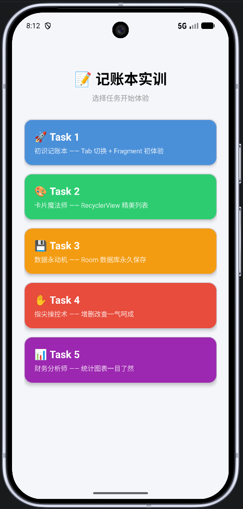
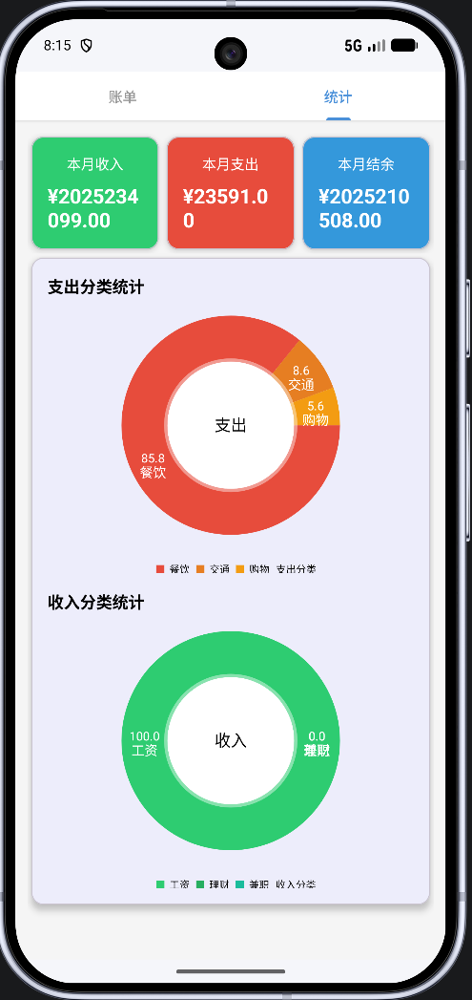
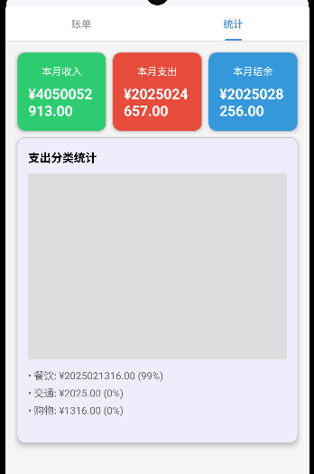

# 📝 个人记账本 (AccountBook)

一个基于 Android 的记账本应用，采用渐进式学习设计，包含 5 个逐步进阶的任务模块。

## 🎯 项目简介

本项目是一个功能完整的记账本应用，通过 Task1-Task5 五个阶段逐步展示 Android 开发的核心技术：
- **Task 1**: Tab 切换 + Fragment 基础架构
- **Task 2**: RecyclerView 精美列表展示
- **Task 3**: Room 数据库持久化存储
- **Task 4**: 完整的增删改查功能
- **Task 5**: 实时统计图表展示

## ✨ 功能特性

### Task 1 - 初识记账本 🚀
- ✅ TabLayout + ViewPager2 实现页面切换
- ✅ Fragment 基础架构搭建
- ✅ 账单页和统计页占位展示

### Task 2 - 卡片魔法师 🎨
- ✅ MaterialCardView 精美卡片设计
- ✅ RecyclerView 列表展示
- ✅ 5 条假数据演示（收入/支出）
- ✅ 悬浮按钮 (FAB) 交互

### Task 3 - 数据永动机 💾
- ✅ Room 数据库集成
- ✅ MVVM 架构模式
- ✅ LiveData 数据观察
- ✅ ViewModel 状态管理
- ✅ 数据永久保存

### Task 4 - 指尖操控术 ✋
- ✅ BottomSheetDialog 添加/编辑弹窗
- ✅ DatePicker 日期选择器
- ✅ Spinner 分类联动
- ✅ 长按删除 + 确认对话框
- ✅ 输入校验

### Task 5 - 财务分析师 📊
- ✅ 实时统计总收入、总支出、结余
- ✅ LiveData 跨 Fragment 数据共享
- ✅ 自动计算与更新（账单页改动 → 统计页刷新）
- ✅ 三列汇总卡片（绿色收入、红色支出、蓝色结余）
- ✅ 饼图占位区（为进阶篇预留）

## 🛠️ 技术栈

| 技术 | 版本 | 说明 |
|------|------|------|
| **Kotlin** | 2.2.10 | 主要编程语言 |
| **AGP** | 9.2.1 | Android Gradle Plugin |
| **Room** | 2.7.2 | 本地数据库 |
| **Lifecycle** | 2.9.0 | ViewModel + LiveData |
| **Material Design** | 1.14.0 | UI 组件库 |
| **ViewPager2** | 1.1.0 | 页面滑动 |
| **KSP** | 2.2.10-2.0.2 | Kotlin Symbol Processing |

##  界面预览

### 主界面

*任务选择菜单，包含 Task 1-5 五个渐进式学习模块，点击任意卡片进入对应功能*

### Task 1-3 - 基础功能
> Task 1-3 主要是基础架构搭建，界面与 Task 4 类似

### Task 4 - 增删改查

#### 账单列表

*精美的卡片式列表，清晰展示收支记录，绿色表示收入，红色表示支出*

#### 添加记录

*底部弹窗 (BottomSheetDialog)，支持选择类型、分类、金额、备注和日期*

### Task 5 - 实时统计与饼图

#### 优化后的统计展示（当前版本）

*环形饼图直观展示收支分类占比，包含图例和百分比，数据实时更新*

#### 优化前的统计展示（旧版本）

*早期版本使用文本列表展示分类统计，后升级为饼图可视化*

## 🚀 快速开始

### 环境要求
- Android Studio Hedgehog 或更高版本
- JDK 11+
- Android SDK API 28+ (Android 9.0)
- Gradle 9.4.1+

### 安装步骤

1. **克隆仓库**
```bash
git clone https://github.com/ljwei-stak/getjobwork.git
cd getjobwork
```

2. **打开项目**
   - 使用 Android Studio 打开项目根目录
   - 等待 Gradle 同步完成

3. **运行应用**
   - 连接真机或启动模拟器
   - 点击 Run 按钮 (▶) 或按 `Shift + F10`

## 📂 项目结构

```
getjobwork/
├── app/
│   ├── src/main/
│   │   ├── java/edu/guigu/accountbook/
│   │   │   ├── data/                  # 数据层
│   │   │   │   ├── dao/              # 数据访问对象
│   │   │   │   │   └── RecordDao.kt
│   │   │   │   ├── database/         # 数据库
│   │   │   │   │   └── AppDatabase.kt
│   │   │   │   ├── model/            # 数据模型
│   │   │   │   │   └── Record.kt
│   │   │   │   └── repository/       # 数据仓库
│   │   │   │       └── RecordRepository.kt
│   │   │   ├── ui/                    # 界面层
│   │   │   │   ├── adapter/          # 适配器
│   │   │   │   │   ├── RecordAdapter.kt
│   │   │   │   │   └── Task2FakeAdapter.kt
│   │   │   │   ├── dialog/           # 对话框
│   │   │   │   │   └── AddEditRecordDialog.kt
│   │   │   │   ├── fragment/         # 碎片
│   │   │   │   │   ├── BillsFragment.kt
│   │   │   │   │   └── StatisticsFragment.kt
│   │   │   │   ├── task/             # 任务 Activity
│   │   │   │   │   ├── Task1Activity.kt
│   │   │   │   │   ├── Task2Activity.kt
│   │   │   │   │   ├── Task3Activity.kt
│   │   │   │   │   ├── Task4Activity.kt
│   │   │   │   │   └── Task5Activity.kt
│   │   │   │   └── viewmodel/        # 视图模型
│   │   │   │       └── RecordViewModel.kt
│   │   │   ├── util/                  # 工具类
│   │   │   │   └── DateUtils.kt
│   │   │   └── MainActivity.kt       # 主活动
│   │   ├── res/                       # 资源文件
│   │   │   ├── layout/               # 布局文件
│   │   │   ├── values/               # 颜色、字符串等
│   │   │   └── drawable/             # 图形资源
│   │   └── AndroidManifest.xml
│   └── build.gradle.kts
├── gradle/
├── build.gradle.kts
└── settings.gradle.kts
```

## 🏗️ 架构设计

本项目采用 **MVVM (Model-View-ViewModel)** 架构模式：

```
┌─────────────┐
│   View      │  ← Activity / Fragment (UI)
└──────┬──────┘
       │ observes
┌──────▼──────┐
│ ViewModel   │  ← LiveData + Coroutine
└──────┬──────┘
       │ calls
┌──────▼──────┐
│ Repository  │  ← 数据仓库
└──────┬──────┘
       │ uses
┌──────▼──────┐
│    DAO      │  ← Room Database
└─────────────┘
```

### 数据流
1. **用户操作** → View (Activity/Fragment)
2. **View** → 调用 ViewModel 方法
3. **ViewModel** → 通过 Repository 访问数据
4. **Repository** → 使用 DAO 操作数据库
5. **数据库变化** → LiveData 自动通知 View 更新

## 📊 数据库设计

### Record 表结构

| 字段 | 类型 | 说明 |
|------|------|------|
| id | Long | 主键，自增 |
| type | Int | 类型：0=支出, 1=收入 |
| category | String | 分类名称 |
| amount | Double | 金额 |
| note | String? | 备注（可选） |
| date | Long | 时间戳（毫秒） |

### 分类列表

**支出分类** (8个):
餐饮 🍜、交通 🚌、购物 🛒、娱乐 🎮、住房 🏠、医疗 🏥、教育 📚、其他 📌

**收入分类** (5个):
工资 💰、兼职 💼、理财 📈、红包 🧧、其他 📌

## 🔧 配置说明

### 依赖配置

项目使用 **Version Catalog** (`gradle/libs.versions.toml`) 管理依赖：

```toml
[versions]
agp = "9.2.1"
kotlin = "2.2.10"
room = "2.7.2"
lifecycle = "2.9.0"
```

### 构建配置

```kotlin
android {
    namespace = "edu.guigu.accountbook"
    compileSdk = 36
    minSdk = 28
    targetSdk = 36
    
    buildFeatures {
        viewBinding = true  // 启用 ViewBinding
    }
}
```

## 🧪 测试

### 运行测试
```bash
# 单元测试
./gradlew test

# 仪器化测试
./gradlew connectedAndroidTest
```

### 测试用例
- ✅ Task 1: Tab 切换流畅性测试
- ✅ Task 2: 列表显示、金额颜色、备注显隐
- ✅ Task 3: 空列表、数据库文件存在性
- ✅ Task 4: 增删改查、输入校验、持久化

## 📝 开发笔记

### AGP 9.x 注意事项

1. **不需要单独声明 kotlin-android 插件**
   ```kotlin
   plugins {
       alias(libs.plugins.android.application)
       // ❌ 不需要: alias(libs.plugins.kotlin.android)
       alias(libs.plugins.ksp)
   }
   ```

2. **不支持 kotlinOptions DSL**
   ```kotlin
   // ❌ 错误写法
   kotlinOptions {
       jvmTarget = "11"
   }
   
   // ✅ 只需保留 compileOptions
   compileOptions {
       sourceCompatibility = JavaVersion.VERSION_11
       targetCompatibility = JavaVersion.VERSION_11
   }
   ```

### ViewBinding 最佳实践

```kotlin
// Fragment 中防止内存泄漏
private var _binding: FragmentBillsBinding? = null
private val binding get() = _binding!!

override fun onDestroyView() {
    super.onDestroyView()
    _binding = null  // ⭐ 重要！
}
```

## 🤝 贡献指南

欢迎提交 Issue 和 Pull Request！

1. Fork 本仓库
2. 创建特性分支 (`git checkout -b feature/AmazingFeature`)
3. 提交更改 (`git commit -m 'Add some AmazingFeature'`)
4. 推送到分支 (`git push origin feature/AmazingFeature`)
5. 开启 Pull Request

## 📄 许可证

本项目采用 MIT 许可证 - 详见 [LICENSE](LICENSE) 文件

## 👨‍💻 作者

- **ljwei-stak** - [GitHub](https://github.com/ljwei-stak)

## 🙏 致谢

感谢以下开源项目：
- [Android Jetpack](https://developer.android.com/jetpack)
- [Room Persistence Library](https://developer.android.com/training/data-storage/room)
- [Material Design Components](https://material.io/components)

---

⭐ 如果这个项目对你有帮助，请给个 Star 支持一下！
